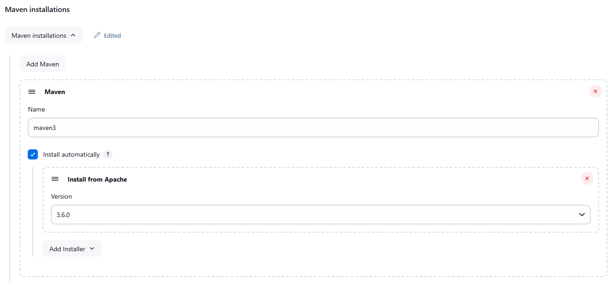
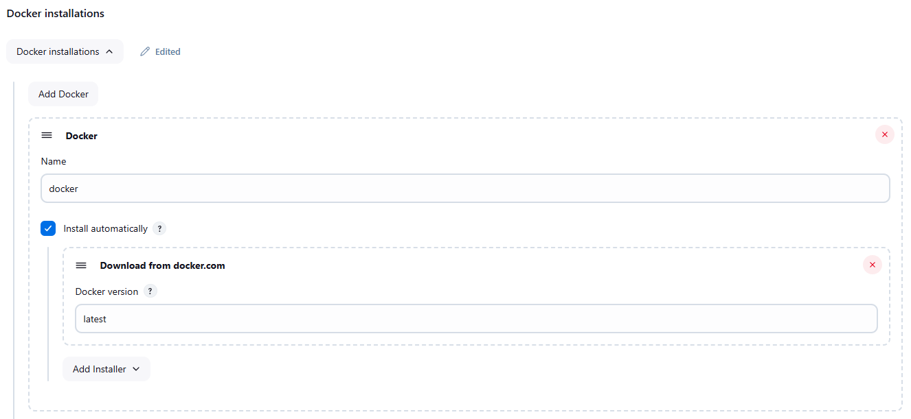
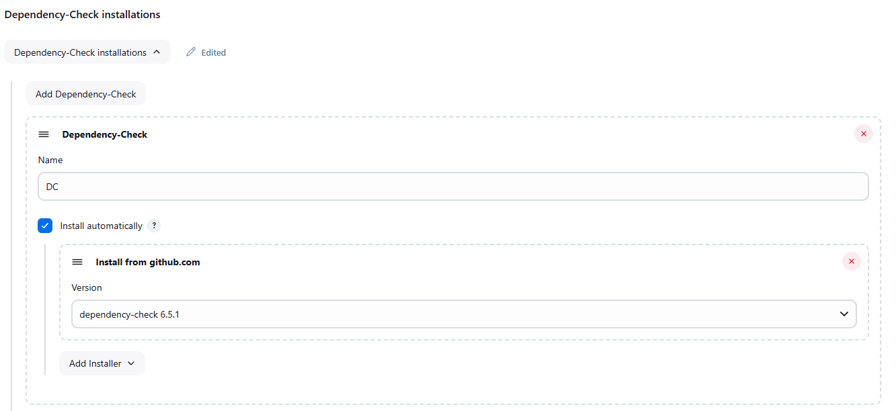
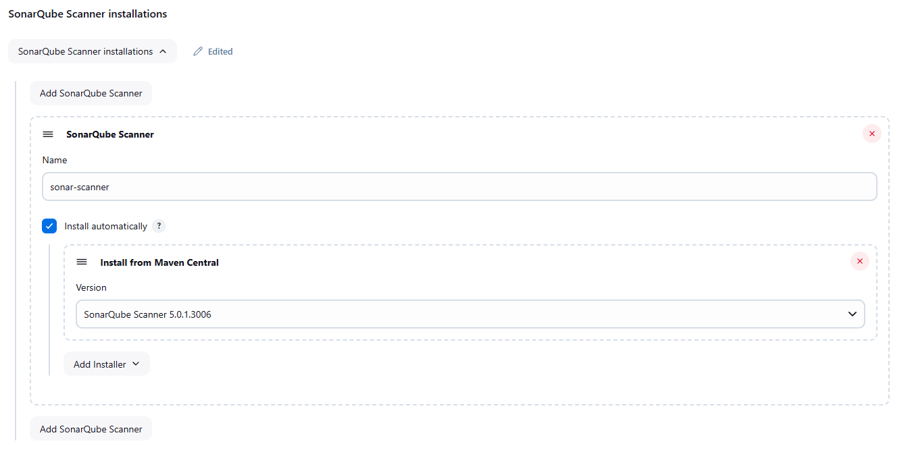
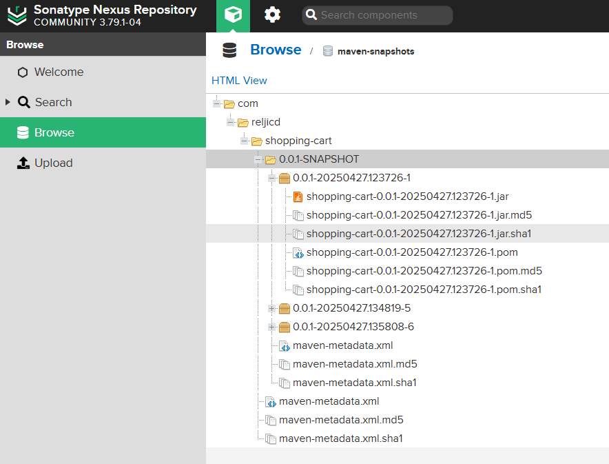
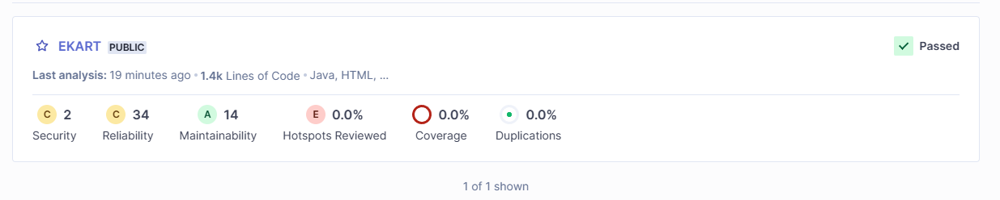
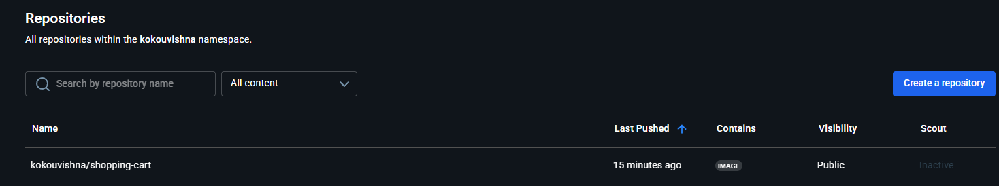

# Jenkins based projects

## Build and deploy Java based application
In this project we'll build and deploy a java based application. We build the application with maven
and deploy it using docker.
The java application is a fully fledged application with a frontent, backend and database.
 
We're going to build this application using maven. We'll also have stages for sonarqube, quality check, 
OS depedency check, and trivy file system scanning. In addition we'll be building the application using maven
and deploying the jar artifacts to nexus third party repository. Nexus is a third party repository manager tool that host
multiple versions of your artifacts.
We'll also be using docker to build the docker image, tag it and push it to a docker hub repository.
At least we'll be deploying the application inside a docker container.

Lets install some plugins; Dashboard > Manage Jenkins > Plugins:
- Eclipse Temurin installer
- SonarQube Scanner
- OWASP Dependency-Check
- Config File Provider (push artifact to the nexus server)
- Docker, Docker Pipeline, docker-build-step
- Pipeline Maven Integration










Lets configure the installed plugins, so that they are available for usage in our pipeline
Dashboard > Manage Jenkins > Tools:
`Install automatically` is always set.
- ``JDK installations`` > ``Add JDK`` > ``Name``: jdk11. Set `Install automatically`. `Add Installer` > `install from adoptium.net`, `Version` > `jdk-11.X`
- `SonarQube Scanner` > `Name` > `Name`: sonar-scanner. `Install from Maven Central` > `Version`: SonarQube Scanner 5.0.1.3006
- `Maven installations` > `Add Maven`: maven3. `Install from Apache` > `Version`: 3.6.0
- `Dependency-Check installations` > `Add Dependency-Check`: DC. `Install from github.com` > `Version`: dependency-check 6.5.1
- `Docker installations` > `Add Docker` > `Docker` > `Name`: docker. `Add Installer` > `Download from docker.com`.
- Click `Apply`

Now lets create a new item of type pipeline, and name it E-kart

Run SonarQube using a docker image
- docker pull sonarqube
- docker run --name sonarqube-custom -p 9000:9000 sonarqube:community
- it can be accessed via `http://localhost:9000`

Run Sonatype Nexus Repository using a docker image
- docker pull sonatype/nexus3
- docker run -d -p 8081:8081 --name nexus sonatype/nexus3
When stopping, be sure to allow sufficient time for the databases to fully shut down:
- docker stop --time=120 <CONTAINER_NAME>
To test:
- curl http://localhost:8081/
- Or access the container with `docker exec -it ca4636f02c06 sh`. In `/nexus-data/admin.password` you'll find the admin password.

On `https://datacadamia.com/maven/distribution_management`, under `Remote Repository Location` you'll find an example to add to the pom.xml

After the pipeline is done, you should see artifacts under ``http://localhost:8081/repository/maven-snapshots/com/reljicd/shopping-cart/0.0.1-SNAPSHOT``.

Install trivy (it can be used to scann docker images as well as file system) where jenkins is running:
````
sudo apt-get install wget apt-transport-https gnupg lsb-release

wget -qO - https://aquasecurity.github.io/trivy-repo/deb/public.key | gpg --dearmor | sudo tee /usr/share/keyrings/trivy.gpg > /dev/null

echo "deb [signed-by=/usr/share/keyrings/trivy.gpg] https://aquasecurity.github.io/trivy-repo/deb $(lsb_release -sc) main" | sudo tee -a /etc/apt/sources.list.d/trivy.list

sudo apt-get update

sudo apt-get install trivy

````

After building, and deploying the app, it can be accessed via `localhost:8070`. User and password are both `admin`.





