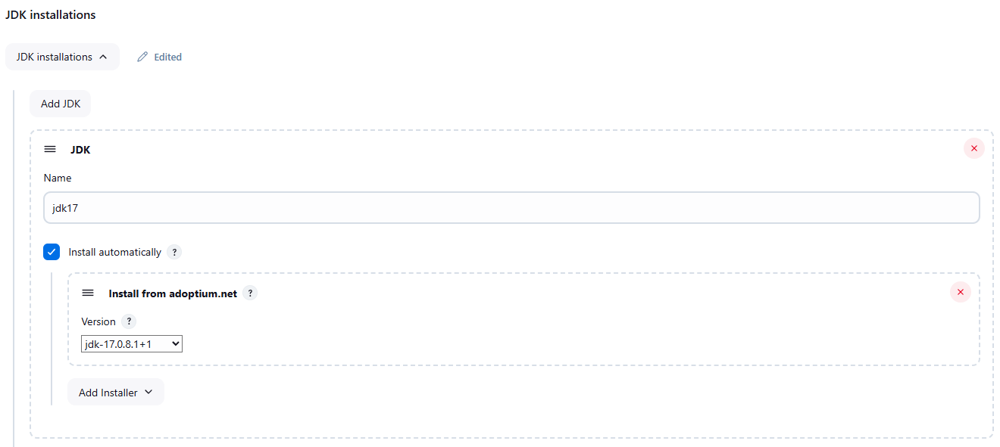

## Project 2 - Build and deploy multi-container NodeJS fullsatck application (frontend, backend and database)

Lets install some plugins; Dashboard > Manage Jenkins > Plugins:
- SonarQube Scanner
- OWASP Dependency-Check
//- Config File Provider (push artifact to the nexus server)
- Docker, Docker Pipeline, docker-build-step
- Pipeline Maven Integration
- NodeJS

OS
- Docker compose > 1.2.6

Lets configure the installed plugins, so that they are available for usage in our pipeline
Dashboard > Manage Jenkins > Tools:
`Install automatically` is always set.
- `SonarQube Scanner` > `Name` > `Name`: sonar-scanner. `Install from Maven Central` > `Version`: SonarQube Scanner 5.0.1.3006
- `Maven installations` > `Add Maven`: maven3. `Install from Apache` > `Version`: 3.6.0
- `Dependency-Check installations` > `Add Dependency-Check`: DC. `Install from github.com` > `Version`: dependency-check 6.5.1
- `Docker installations` > `Add Docker` > `Docker` > `Name`: docker. `Add Installer` > `Download from docker.com`.
- ``NodeJS installations`` > ``Add NodeJS`` > ``NodeJS`` > ``Name``: node16. ``Version``: 16.20.2
- Click `Apply`